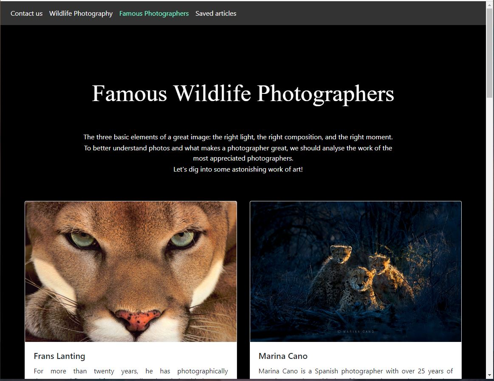
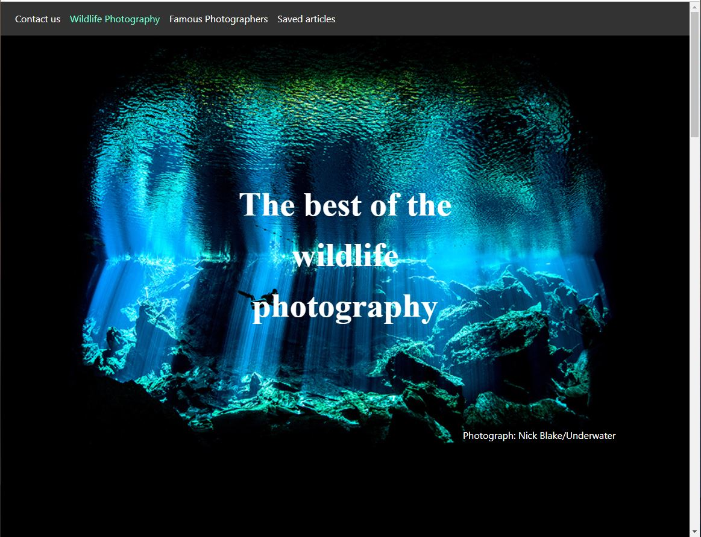
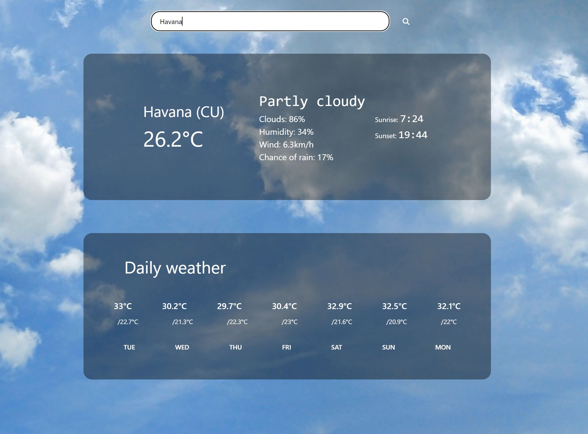
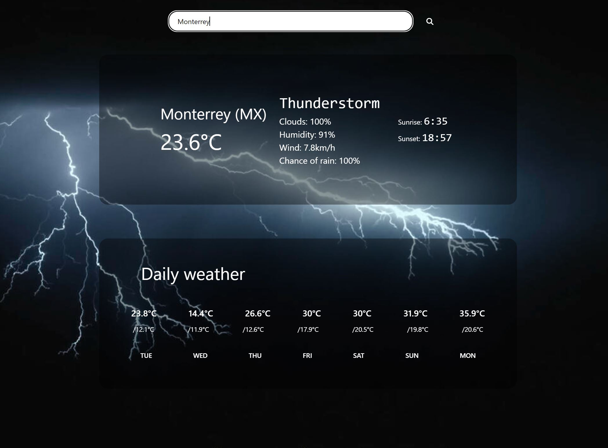

## Paula Huhu

Banking & Finance graduate. Always having a desire to learn, now I am a Javascript developer, looking for a job in web development.

Banking & Finance graduate.
: Always having a desire to learn, now I am a JavaScript developer, looking for a job in web development.

---

<a href="#contact" style="color: #472CE6">Contact </a> | <a href="#projects" style="color: #472CE6">Projects </a> | <a href="#technical-skills" style="color: #472CE6">Technical skills </a> | <a href="#soft-skills" style="color: #472CE6">Soft Skills </a> | <a href="#experience" style="color: #472CE6">Experience </a> | <a href="#education" style="color: #472CE6">Education</a> | <a href="#hobbies" style="color: #472CE6">Hobbies</a> | <a href="#more" style="color: #472CE6">See more</a>

### 
Contact

 &nbsp; &nbsp; &nbsp; &nbsp; &nbsp; &nbsp; &nbsp; &nbsp; 

something about me.

***

### 
HyperionDev Projects

| Project | Repository | Description | Technologies Used | Link | Preview |
| --- | --- | --- | --- | --- | --- |
| **Wildlife Photography** |&nbsp; &nbsp;   | Project created using only frontend HTML and CSS. Requirements were: have a functional "save for later" button and page, a form for comments, a like button for multiple photos/articles and a contact form. This website is hosted by GitHub Pages.| HTML, CSS, Bootstrap | <a href="https://paulahh.github.io/photographers.html">See website</a> | &nbsp;  |
| **Weather App** |&nbsp; &nbsp;   | Client-side dynamic weather web application that generates data based on user input. Background is also dynamic and it changes depending on the weather code. This app make use of 2 free public APIs. | JavaScript, HTML, CSS, Bootstrap, API | --- | &nbsp;  |
| **Periodic Table** |&nbsp; &nbsp;   | --- | HTML, CSS, Responsive Web Design | -- | --- |

---

### 
Technical skills

**JavaScript**

**HTML**

**CSS**

**React.js**

**Express.js**

**MongoDB**

**Mongoose**

---

### 
Soft skills

**Communication**

**Problem Solving**

**Adaptability**

**Organisational skills**

**Time management**

---

### 
Experience

**Customer Service Advisor** (internship)
UniCredit Bank, Romania  (*15 Jun 2021 - 15 Aug 2021*)          

---

### 
Education

**HyperionDev Bootcamp**
(*dec 2022 - march 2023*)

- Fullstack development bootcamp, focused on front-end
- Main subjects: JavaScript, CSS, HTML, React
- Average grade: 98%

**Alexandru Ioan Cuza University of Iasi, Romania**
(*2019 - 2022*)

- Banking and finance degree
- Main subjects: Banking / Economics / Capital markets / Finance
- Average grade: 7.19/ 10 (UK equivalent: First-Class Honours)

---

### 
More about me

 * Languages:
    * English - upper intermediate (B2)
    * Romanian - native

* Knowledge:
    * Microsoft Suite
    * Basic knowledge of Tableau
     
