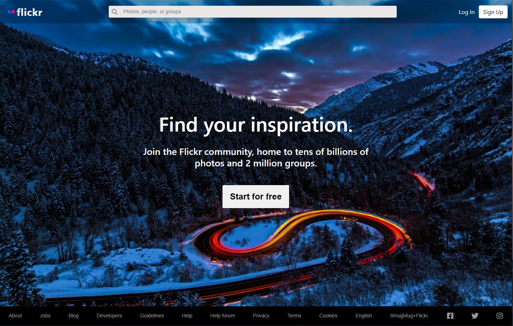

## Paula Huhu

Banking & Finance graduate. Always having a desire to learn, now I am a Javascript developer, looking for a job in web development.

---
<a href="#contact" style="color: #472CE6">Contact </a> | <a href="#projects" style="color: #472CE6">Projects </a> | <a href="#technical-skills" style="color: #472CE6">Technical skills </a> | <a href="#soft-skills" style="color: #472CE6">Soft Skills </a> | <a href="#experience" style="color: #472CE6">Experience </a> | <a href="#education" style="color: #472CE6">Education</a> | <a href="#more" style="color: #472CE6">See more</a>

---
### 
Contact

 &nbsp; &nbsp; &nbsp; &nbsp; &nbsp; &nbsp; &nbsp; &nbsp; 

---

### 
HyperionDev Projects

| Project | Repository | Description | Technologies Used | Link | Preview |
| --- | --- | --- | --- | --- | --- |
| **Weather App** |&nbsp; &nbsp;   | This is a client-side weather web application that dynamically generates data according to user input. The app utilizes two free public APIs and features a dynamic background that changes based on the weather code. | JavaScript, Bootstrap, API, HTML, CSS |  &nbsp; &nbsp; --- | &nbsp;  |
| **Wildlife Photography** |&nbsp; &nbsp;   | This project's specifications included a "save for later" button and page, a comment form, a like button for multiple photos/articles, and a contact form. The website is currently hosted on GitHub Pages.| Javascript, Bootstrap, HTML, CSS | <a href="https://github.com/PaulaHh/PaulaHh.github.io">See website</a> | &nbsp;  |
| **Periodic Table** |&nbsp; &nbsp;   | Periodic table project created in HTML. The project centered on CSS, responsive web design, and grid display. | Responsive Web Design, HTML, CSS | &nbsp; &nbsp; --- |  |
| **Personal Website** | &nbsp; &nbsp;   | The website includes my personal information and resume. I plan to create a new design for the website in the future, which will contain a navigation bar. | React, Create React App, HTML, CSS | <a href="https://www.paulahuhu.com/">See website</a> |  |
| **Flickr Clone** | &nbsp; &nbsp;   | The purpose of this project was to enhance my frontend skills by replicating a website. Currently, the website lacks any functionality, and all links redirect to various sections of the original website. The emphasis was placed on gaining a better understanding of CSS styling.| Javascript, React, Create React App, HTML, CSS | --- |  |
| **Multi Timezone clock** | &nbsp; &nbsp;   | This website features a multi-timezone clock with basic functionality. | Javascript, HTML, CSS | --- |  |
| **Book Catalogue** | &nbsp; &nbsp;   | This website allows users to consolidate information about all their books in one place by using the form provided to input their books' details.| Javascript, HTML, CSS | ---  |  |
| **Shopping List** | &nbsp; &nbsp;   | This is a basic functionality shopping list that allows users to add, check/uncheck, and delete items from the list. | Javascript, HTML, CSS | --- |  |

---

### 
Technical skills

**JavaScript**

**HTML**

**CSS**

**React.js**

**Express.js**

**MongoDB**

**Mongoose**

---

### 
Soft skills

**Communication**

**Problem Solving**

**Adaptability**

**Organisational skills**

**Time management**

---

### 
Experience

**Customer Service Advisor** (internship)
UniCredit Bank, Romania  (*15 Jun 2021 - 15 Aug 2021*)          

---

### 
Education

**HyperionDev Bootcamp**
(*dec 2022 - march 2023*)

- Fullstack development bootcamp, focused on front-end
- Main subjects: JavaScript, CSS, HTML, React
- Average grade: 98%

**Alexandru Ioan Cuza University of Iasi, Romania**
(*2019 - 2022*)

- Banking and finance degree
- Main subjects: Banking / Economics / Capital markets / Finance
- Average grade: 7.19/ 10 (UK equivalent: First-Class Honours)

---

### 
More about me

 * Languages:
    * English - upper intermediate (B2)
    * Romanian - native

* Knowledge:
    * Microsoft Suite
    * Basic knowledge of Tableau
     
